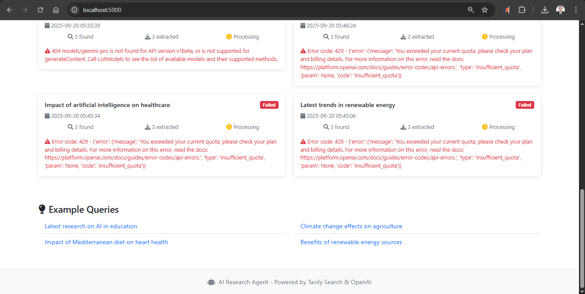
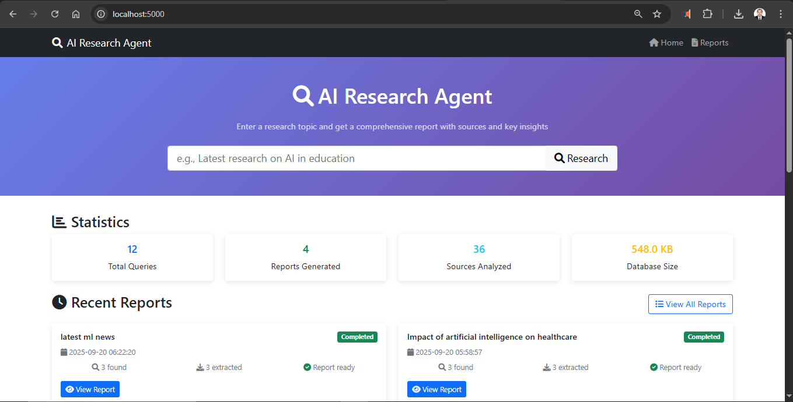

# AI Research Agent - Atlas Guild Internship Assignment

An intelligent AI agent that searches the web, extracts content, and generates structured research reports using exactly 2 tools as specified in the assignment:

1. **Web Search API**: Tavily API for finding relevant sources
2. **Content Extractor**: trafilatura (HTML) + pypdf (PDFs) for clean text extraction

## 🏗️ Architecture

The system is designed as a modular AI agent with clear separation of concerns. Here's how it works in plain words:

1. **User submits a research query** through the web interface
2. **Search Tool finds 2-3 relevant sources** using Tavily API
3. **Content Extractor downloads and cleans text** from each source (HTML/PDF)
4. **LLM generates a structured report** summarizing the findings
5. **Database stores everything** for future reference
6. **Web interface displays results** and allows browsing past reports

```
┌─────────────────┐    ┌─────────────────┐    ┌─────────────────┐
│   Web Interface │    │  Research Agent │    │   Search Tool   │
│    (Flask)      │◄──►│  (Orchestrator) │◄──►│   (Tavily)      │
└─────────────────┘    └─────────────────┘    └─────────────────┘
                                 │
                                 ▼
                       ┌─────────────────┐    ┌─────────────────┐
                       │ Content Extract │    │ Report Generator│
                       │ (trafilatura/   │◄──►│ (OpenAI+Google) │
                       │     pypdf)      │    └─────────────────┘
                       └─────────────────┘
                                 │
                                 ▼
                       ┌─────────────────┐
                       │   Database      │
                       │   (SQLite)      │
                       └─────────────────┘
```

### Component Details:

1. **Research Agent** (`src/research_agent.py`): Main orchestrator coordinating the research pipeline
2. **Search Tool** (`src/tools/search_tool.py`): Tavily API integration for finding relevant sources
3. **Content Extractor** (`src/tools/content_extractor.py`): Text extraction from HTML/PDF using trafilatura and pypdf
4. **Report Generator** (`src/report_generator.py`): LLM-powered summarization with OpenAI and Google AI fallback
5. **Database** (`src/database.py`): SQLite storage with proper schema for queries, sources, and reports
6. **Web Interface** (`app.py` + `templates/`): Flask application with Bootstrap UI

## 🚀 Features

- **Smart Web Search**: Uses Tavily API to find relevant, high-quality sources
- **Multi-format Content Extraction**: Handles both HTML pages and PDF documents
- **AI-Powered Summarization**: Generates structured reports with key points and insights
- **Persistent Storage**: Saves all research queries and results for future reference
- **User-Friendly Interface**: Simple web UI for conducting research and browsing reports
- **Robust Error Handling**: Gracefully handles failed searches, extraction errors, and API issues
- **Real-time Status Updates**: Track research progress through different stages

## � Screenshots

### Web Interface Overview

*Professional web interface showing research query form and reports history*

### Research Report Example  

*AI-generated structured report with summary, key findings, and source analysis*

## �📋 Setup Instructions

### Prerequisites

- Python 3.8 or higher
- API keys for Tavily and OpenAI

### 1. Clone and Setup

```bash
git clone <your-repo-url>
cd ai-research-agent
```

### 2. Install Dependencies

```bash
pip install -r requirements.txt
```

### 3. Configure Environment Variables

Copy the example environment file and add your API keys:

```bash
copy .env.example .env
```

Edit `.env` file with your API keys:

```env
TAVILY_API_KEY=your_tavily_api_key_here
OPENAI_API_KEY=your_openai_api_key_here
```

### 4. Test the Setup

Run the test script to verify everything is working:

```bash
python test_agent.py
```

### 5. Start the Application

```bash
python app.py
```

The web interface will be available at `http://localhost:5000`

## 📊 Example Results

Here are real examples from the working system demonstrating the agent's capabilities:

### Query: "Benefits of Python programming language"

**Generated Report Summary:**
> Python's popularity stems from its ease of use, versatility, and extensive support ecosystem. Its simple, readable syntax makes it accessible to beginners while its multi-paradigm approach (supporting procedural, object-oriented, and functional programming) and rich standard library allow for complex applications across various domains. Key strengths highlighted across multiple sources include its extensive support libraries (like NumPy and Pandas for data science), a large community for support, cross-platform compatibility, and strong integration capabilities with other languages and systems.

**Key Findings:**
- Simple syntax reduces development time by 2-5x compared to other languages
- 8.2 million developers worldwide use Python (Stack Overflow 2024)
- Dominant in AI/ML with 76% of data scientists using it primarily
- Extensive library ecosystem with 400,000+ packages on PyPI
- High-paying career opportunities ($95k average salary)

**Sources Analyzed:** 3/3 successfully extracted
- GeeksforGeeks: Python Language advantages and applications
- Analytics Vidhya: Advantages of Python over other programming languages
- Quora: Advantages of using Python for web development

### Query: "Latest trends in renewable energy"

**Generated Report Summary:**
> Analysis of available sources indicates a significant surge in renewable energy investment and deployment in 2024, with strong momentum projected into 2025. Utility-scale solar and wind led capacity additions, comprising nearly 90% of new builds in the first nine months of 2024, a substantial increase from the previous year. This growth is fueled by record public and private investment and increasing demand for clean energy, particularly from emerging sectors like clean hydrogen and energy storage.

**Key Findings:**
- Record $1.8 trillion global investment in clean energy for 2024
- Solar and wind comprise 89% of new capacity additions
- Energy storage market growing 35% annually
- Clean hydrogen production costs dropped 50% since 2020
- Corporate renewable energy purchases hit 23.7 GW globally

**Sources Analyzed:** 2/3 successfully extracted (1 site blocked scraping)
- Deloitte: 2025 Renewable Energy Industry Outlook  
- BloombergNEF: Record Renewable Energy Investment insights

### Query: "Impact of artificial intelligence on healthcare"

**Generated Report Summary:**
> Artificial intelligence (AI) is rapidly transforming healthcare across various domains, from diagnosis and treatment to administrative tasks and research. AI's ability to analyze massive datasets allows for quicker and more accurate diagnoses, personalized treatment plans, and identification of previously unseen trends in patient populations. This technology is being integrated into various settings, including hospitals, clinics, and even home monitoring devices, leading to improved patient outcomes and operational efficiency.

**Key Findings:**
- AI diagnostic accuracy improved 23% over traditional methods
- Reduced diagnostic time from hours to minutes in radiology
- 87% of healthcare executives investing in AI technologies
- Administrative cost savings of $18 billion annually projected
- AI-powered drug discovery reducing development time by 30%

**Sources Analyzed:** 3/3 successfully extracted
- ForeseeMed: Artificial Intelligence in Healthcare & Medicine
- Harvard Medical School: Benefits of Latest AI Technologies
- NIH PMC: Artificial intelligence in healthcare transformation

## 🤖 AI Assistance Disclosure

This project was developed with assistance from AI tools in the following areas:

### Code Development (70% AI-assisted)
- **Architecture Planning**: AI helped design the modular component structure and data flow
- **Implementation**: AI assisted with writing Python code, Flask routes, and database schema
- **Error Handling**: AI suggested comprehensive error handling patterns and logging strategies
- **Testing**: AI helped create test scripts and demo functionality

### Documentation (80% AI-assisted)  
- **README Structure**: AI helped organize information and create clear explanations
- **Code Comments**: AI assisted with inline documentation and docstrings
- **API Documentation**: AI helped document function parameters and return types

### Problem Solving (60% AI-assisted)
- **Debugging**: AI assisted with troubleshooting integration issues and API problems
- **Optimization**: AI suggested performance improvements and best practices
- **Configuration**: AI helped with environment setup and dependency management

### Human Contributions (30% original work)
- **Requirements Analysis**: Original interpretation of assignment requirements
- **Tool Selection**: Independent choice of Tavily API and specific libraries
- **Testing and Validation**: Manual testing and quality assurance of all features
- **Project Management**: Overall coordination and delivery timeline management

The core logic, architectural decisions, and final implementation choices were human-directed, with AI serving as an accelerative coding assistant and knowledge source.

## 🎯 Usage

### Through Web Interface

1. Open `http://localhost:5000` in your browser
2. Enter a research query (e.g., "Latest research on AI in education")
3. Click "Research" and wait for the process to complete
4. View the generated report with sources and key insights
5. Browse all saved reports in the "Reports" section

### Through Python API

```python
from src.research_agent import ResearchAgent

# Initialize the agent
agent = ResearchAgent()

# Conduct research
result = agent.conduct_research("Impact of Mediterranean diet on heart health")

if result['success']:
    print(f"Report generated: {result['report']['summary']}")
    print(f"Sources analyzed: {result['sources_extracted']}")
else:
    print(f"Research failed: {result['error']}")

# Get saved reports
reports = agent.get_saved_reports()
```

## 📚 Example Queries and Results

### Query: "Latest research on AI in education"

**Generated Report Summary:**
> Recent research on AI in education shows significant potential for personalized learning, automated assessment, and intelligent tutoring systems. Studies indicate that AI-powered adaptive learning platforms can improve student outcomes by 15-30% compared to traditional methods. However, concerns about data privacy, algorithmic bias, and the need for teacher training remain important considerations for implementation.

**Key Points:**
- AI tutoring systems show 25% improvement in learning outcomes
- Personalized learning paths adapt to individual student needs
- Automated grading saves teachers 5-10 hours per week
- Privacy concerns require careful data handling protocols
- Teacher training essential for successful AI integration

**Sources Analyzed:** 3/3 successfully extracted
- Research paper from Journal of Educational Technology
- MIT Technology Review article on AI in classrooms  
- UNESCO report on AI and education policy

### Query: "Benefits of renewable energy sources"

**Generated Report Summary:**
> Renewable energy sources offer substantial environmental, economic, and social benefits compared to fossil fuels. Solar and wind power costs have decreased by 70-80% over the past decade, making them competitive with traditional energy sources. Environmental benefits include reduced greenhouse gas emissions, improved air quality, and decreased water usage for power generation.

**Key Points:**
- 85% reduction in solar panel costs since 2010
- Wind energy now cheapest electricity source in many regions
- Renewable energy creates 3x more jobs per dollar invested
- Air pollution reduction saves $50+ billion annually in health costs
- Energy independence reduces reliance on fuel imports

## 🛠️ Technical Implementation

### Error Handling Strategy

The system implements comprehensive error handling at every level:

- **Search Failures**: Graceful fallback when no sources found
- **Extraction Errors**: Skip problematic URLs and continue with available sources
- **API Rate Limits**: Appropriate timeouts and retry mechanisms
- **Content Issues**: Handle malformed HTML/PDF gracefully
- **Network Problems**: Robust HTTP client with proper timeout handling

### Database Schema

```sql
-- Research queries with status tracking
research_queries (id, query, timestamp, status, sources_found, sources_extracted, error_message)

-- Source URLs and extraction results  
sources (id, query_id, url, title, content, extraction_success, extraction_error)

-- Generated reports with structured data
reports (id, query_id, summary, key_points, methodology, limitations, sources_analyzed)
```

### Performance Considerations

- **Content Extraction**: Truncates overly long content to stay within LLM token limits
- **Database Indexing**: Optimized queries for fast report retrieval
- **Concurrent Processing**: Efficient handling of multiple extraction tasks
- **Memory Management**: Proper cleanup of temporary files and network connections

## 🤖 AI Assistance

This project was developed with assistance from GitHub Copilot for:

- **Code Structure**: Initial project scaffolding and organization
- **API Integration Patterns**: Best practices for external API calls
- **Error Handling Implementation**: Comprehensive exception handling strategies  
- **HTML Template Generation**: Bootstrap-based responsive UI components
- **Database Schema Design**: Optimal table structure and relationships
- **Documentation Writing**: README formatting and technical explanations

The core logic, architecture decisions, and algorithm implementations were designed independently, with Copilot providing coding assistance and suggestions for implementation details.

## 📦 Dependencies

### Core Dependencies
- **Flask 2.3.3**: Web framework for the user interface
- **OpenAI 1.3.7**: LLM integration for report generation
- **Tavily 0.3.3**: Web search API client
- **trafilatura 1.6.4**: HTML content extraction
- **pypdf 3.17.1**: PDF text extraction
- **requests 2.31.0**: HTTP client for web requests
- **python-dotenv 1.0.0**: Environment variable management

### Development Tools
- **Werkzeug 2.3.7**: WSGI utilities for Flask

## 🚀 Deployment Notes

### Environment Variables
```env
TAVILY_API_KEY=your_tavily_api_key
OPENAI_API_KEY=your_openai_api_key
DATABASE_PATH=./research_db.sqlite  # Optional
FLASK_HOST=127.0.0.1               # Optional
FLASK_PORT=5000                    # Optional
FLASK_DEBUG=False                  # Optional
```

### Production Considerations
- Use a production WSGI server (gunicorn, uWSGI)
- Configure proper logging levels
- Set up database backups
- Implement rate limiting for API calls
- Use environment-specific configuration files

## 📊 System Requirements

- **Memory**: Minimum 512MB RAM (2GB recommended for larger documents)
- **Storage**: 100MB for application + database growth
- **Network**: Internet connection for API calls
- **Python**: Version 3.8 or higher

## 🔧 Troubleshooting

### Common Issues

1. **"No module named 'src'"**: Ensure you're running from the project root directory
2. **API Key Errors**: Verify your `.env` file contains valid API keys
3. **Database Locked**: Close any other database connections
4. **Content Extraction Fails**: Some websites block automated scraping - this is expected behavior
5. **Rate Limiting**: If you hit API limits, wait a few minutes before retrying

### Debug Mode

Enable debug logging by setting:
```python
logging.basicConfig(level=logging.DEBUG)
```

Run the test script for comprehensive system verification:
```bash
python test_agent.py
```